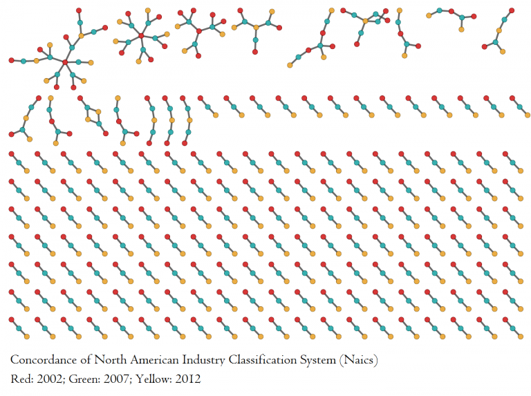

# Uso de datos de empleo en el margen extensivo

Los datos de comercio internacional que se utilizan para el análisis del margen intensivo carecen de registros correspondientes a actividades de servicios. Dada la importancia del sector servicios en las economías, para el análisis del margen extensivo (esto es, identificación de industrias con una capacidad promisoria de desarrollo) se utilizaron datos de empleo de México y El Salvador para realizar el análisis de complejidad al comparar Zonas Metropolitanas de México con El Salvador.

Los datos de empleo de México provienen de los informes mensuales del Instituto Mexicano del Seguro Social (IMSS), los cuales son publicados desde 1997. Los datos de empleo de El Salvador corresponden al Instituto Salvadoreño de Seguridad Social, y tienen una frecuencia mensual y cubre el periodo 2013-2023. Desde el punto metodológico, ambos datos son comparables dado que provienen de registros administrativos.

Un primer reto para realizar el análisis de complejidad en el margen extensivo fue contar con un sistema de clasificación industrial harmonizado para ambos países. Los datos de empleo de El Salvador están registrados con la Clasificación Industrial Internacional Uniforme en su versión 4 (CIIU Rev 4) para 4 dígitos de agregación. Para el caso de México, el IMSS utiliza una clasificación propia. Para hacer comparable la clasificación IMSS con CIIU, se realizó en primer lugar una correspondencia de la clasificación del IMSS con el Sistema de Clasificación Industrial para América del Norte (SCIAN) en su versión 2018 a nivel de clase de actividad. Posteriormente, se utilizó el diccionario entre las clasificaciones SCIAN 2018 y CIIU Rev 4. Cabe señalar que dicho diccionario entre SCIAN 2018 y CIIU Rev 4 tuvo que ser ajustado con una metodología de clusterización en redes complejas. Este ajuste fue necesario dado que hay una relación muchos a muchos entre las actividades. El ajuste permitió eliminar las ambiguedades entre actividades y así obtener una relación uno a uno entre las activades CIIU Rev 4 y las activades SCIAN. Lo anterior significó generar una clasificación propia del CIIU Rev 4 donde se realizó una agrupación de actividades.

## Metodología de [Diodato](https://www.dariodiodato.com/category/concordances/) para armonizar Sistemas de Clasificación

El problema entre sistemas de clasificación consiste en que en frecuentes ocasiones existen relaciones muchos a muchos entre las categorias de los sistemas de clasificación. Esto es, una actividad de un sistema puede corresponder a más de una actividad en otro sistema de clasificación. Si se usan las tablas de correspondencia que ofrecen los institutos de estadística son ningún tratamiento previo para controlar estas relaciones muchos a muchos puede significar la doble contabilidad de actividades, lo cual se traduce en una doble contabilización de la actividad. Por lo anterior, es preciso realizar un tratamiento previo a los diccionarios de correspondencias entre sistemas de clasificación para obtener relaciones uno a uno entre las actividades.

[Dario Diodato](https://www.dariodiodato.com/category/concordances/) presenta una metología basada en redes para armonizar sistemas de clasificación. A grandes rasgos, la propuesta consiste en construir una red no dirigida a partir de los diccionarios de correspondencias entre las actividades para posteriormente ejecutar algún algoritmo de cluster en redes para generar así relaciones uno a uno entre las actividades. La siguiente figura presenta un ejemplo de correspondencias entre actividades para tres sistemas de clasificación industrial. Los colores de los nodos corresponden a los sistemas de clasificación mientras que las aristas son las relaciones definidas en las correspondencias. Las relaciones muchos a muchos se manifiestan en los componentes conexos más grandes de la red.

Para el presente estudio, se armonizaron tres sistemas de clasificación : NAICS 2017, CIIU Rev 4 y SCIAN 2018. En la siguiente [liga](https://github.com/milocortes/InvESt_complexity/tree/main/datos/cws/empleo/ciiu-recodificacion-dario-diodato) se presentan los programas que generan la nueva clasificación CIIU Rev 4 que armoniza los tres sistemas de clasificación.

La siguiente tabla presenta en extenso la nueva clasificación CIIU Rev 4 con sus correspondencias con SCIAN 2018, NAICS 2017, así como las actividades CIIU que está agrupando.

{{#include tables/ciiu_recod_naics_scian.md}}

