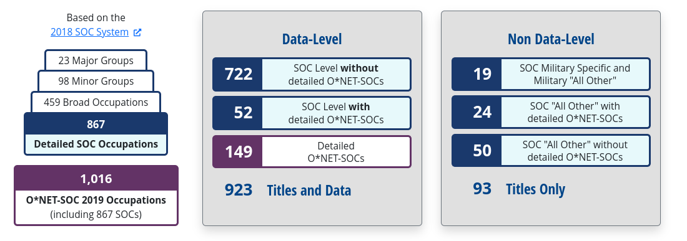
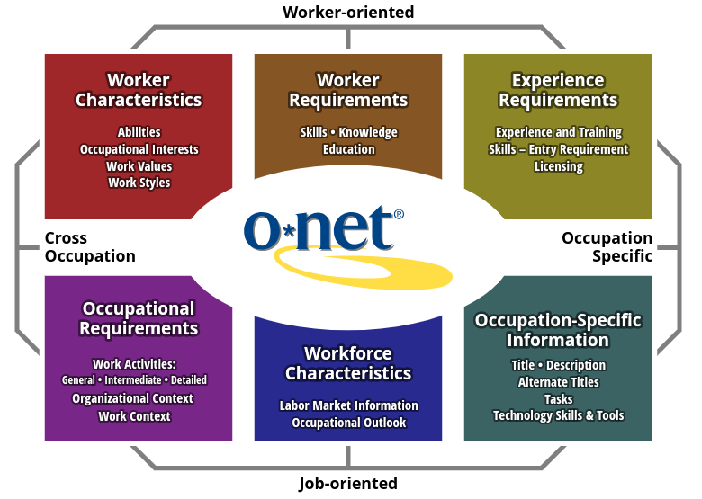

# Datos de Educación, Knowledge, Skills y Abilities de O*NET 

[O*NET](https://www.onetcenter.org/overview.html) (Occupational Information Network) ofrece información sobre tipos de ocupación para USA. O*NET se desarrolla bajo el patrocinio de la U.S. Department of Labor/Employment and Training Administration (USDOL/ETA).

Cada ocupación necesita una combinación diferente de conocimientos(knowledge) y habilidades (skills-abilities) para llevar acabo distintas actividades y tareas.

O*NET define una [taxonomía](https://www.onetcenter.org/taxonomy.html) para el conjunto de ocupaciones, la cual está basada en [Standard Occupational Classification](https://www.onetcenter.org/taxonomy.html)(SOC). La actual taxonomía incluye 923 ocupaciones, las cuales se actualizan periodicamente. La más reciente revisión es la correspondiente a [2019](https://www.onetcenter.org/taxonomy/2019/list.html). la cual se organiza en la siguiente clasificación:

## O*NET 28.2 Database

La base de datos de O*NET contiene una variedad de variables que describen las características del trabajo y trabajadores, incluyendo requerimientos de habilidades, nivel educativo, experiencia, conocimientos, etc.

## O*NET *Model Content*

El *Model Content* proporciona el marco que identifica los más importantes tipos de información acerca del trabajo, y los integra a un marco teórico y empírico. 

El *Model Content* se desarrolló utilizando investigaciones sobre análisis de puestos y organizaciones. Incorpora una visión que refleja el carácter de las ocupaciones (a través de descriptores orientados al trabajo) y de las personas (a través de descriptores orientados al trabajador).

El *Model Content* también permite que la información ocupacional se aplique en todos los trabajos, sectores o industrias (descriptores interocupacionales) y dentro de las ocupaciones (descriptores ocupacionales específicos). Estos descriptores están organizados en seis dominios principales, que permiten al usuario centrarse en áreas de información que especifican los atributos y características clave de los trabajadores y ocupaciones.

### Worker Characteristics

Características duraderas que pueden influir tanto en el desempeño como en la capacidad de adquirir conocimientos y habilidades necesarios para un desempeño laboral eficaz.

* Abilities : Atributos duraderos del individuo que influyen en el desempeño.

### Worker Requirements

Descriptores que se refieren a atributos relacionados con el trabajo adquiridos y/o desarrollados a través de la experiencia y la educación.

* Skills : Capacidades desarrolladas que facilitan el aprendizaje o la adquisición más rápida de conocimientos.
* Knowledge : Conjuntos organizados de principios y hechos que se aplican en dominios generales.
* Education : Experiencia educativa previa requerida para desempeñarse en un puesto de trabajo.

### Knowledge, Skills, Abilities

Los datos presentan información de Knowledge, Skills y Abilities asociado con cada ocupación O*NET. La información está organizada de acuerdo a los siguientes campos:

{{#include tables/knowledge_campos.md}}

Un ejemplo de Element ID, Element Name para Knowledge y Skills así como su descripción es el siguiente:

| Element ID   | Element Name           | Description                                                                                                 |
|:-------------|:-----------------------|:------------------------------------------------------------------------------------------------------------|
| 1            | Worker Characteristics | Worker Characteristics                                                                                      |
| 1.A          | Abilities              | Enduring attributes of the individual that influence performance                                            |
| 1.A.1        | Cognitive Abilities    | Abilities that influence the acquisition and application of knowledge in problem solving                    |
| 1.A.1.a      | Verbal Abilities       | Abilities that influence the acquisition and application of verbal information in problem solving           |
| 1.A.1.a.1    | Oral Comprehension     | The ability to listen to and understand information and ideas presented through spoken words and sentences. |

El listado completo puede descargarse de la siguiente [liga](https://www.onetcenter.org/dl_files/database/db_28_2_text/Content%20Model%20Reference.txt)

Los campos Scale ID y Scale Name representan categorias de escalas de ordenamiento las cuales tienen las siguientes etiquetas así como sus los valores mínimos y máximos:

| Scale ID   | Scale Name                                    |   Minimum |   Maximum |
|:-----------|:----------------------------------------------|----------:|----------:|
| CT         | Context                                       |         1 |         3 |
| CTP        | Context (Categories 1-3)                      |         0 |       100 |
| CX         | Context                                       |         1 |         5 |
| CXP        | Context (Categories 1-5)                      |         0 |       100 |
| IM         | Importance                                    |         1 |         5 |
| LV         | Level                                         |         0 |         7 |
| OJ         | On-The-Job Training (Categories 1-9)          |         0 |       100 |
| PT         | On-Site Or In-Plant Training (Categories 1-9) |         0 |       100 |
| RL         | Required Level Of Education (Categories 1-12) |         0 |       100 |
| RW         | Related Work Experience (Categories 1-11)     |         0 |       100 |

El listado completo puede descargarse de la siguiente [liga](https://www.onetcenter.org/dl_files/database/db_28_2_text/Scales%20Reference.txt)

Los campos Data Value, N, Standard Error, Lower CI Bound, Upper CI Bound, Recommend Suppress y Not Relevant corresponden a estadísticas de nivel de calificación, así como errores estándar e indicadores de datos para ayudar a proporcionar una descripción de la calidad de los valores de los datos.

La descripción completa de estos campos se encuentran en la siguiente [liga](https://www.onetcenter.org/dictionary/28.2/excel/appendix_incumbent.html)

### Education, Training, and Experience

Los datos contienen la frecuencia porcentual de educación, capacitación y experiencia, asociada con las categorías de ocupación.

Para el caso específico de Educación, los datos presentan información del porcentaje de trabajadores que cuentan con algún grado de educación para cada categoría de ocupación de la taxonomía de O*NET. Por ejemplo, para la categoría 11-1011.00 Chief Executives, se tiene la siguiente información:

{{#include tables/onet_nivel_educativo.md}}
